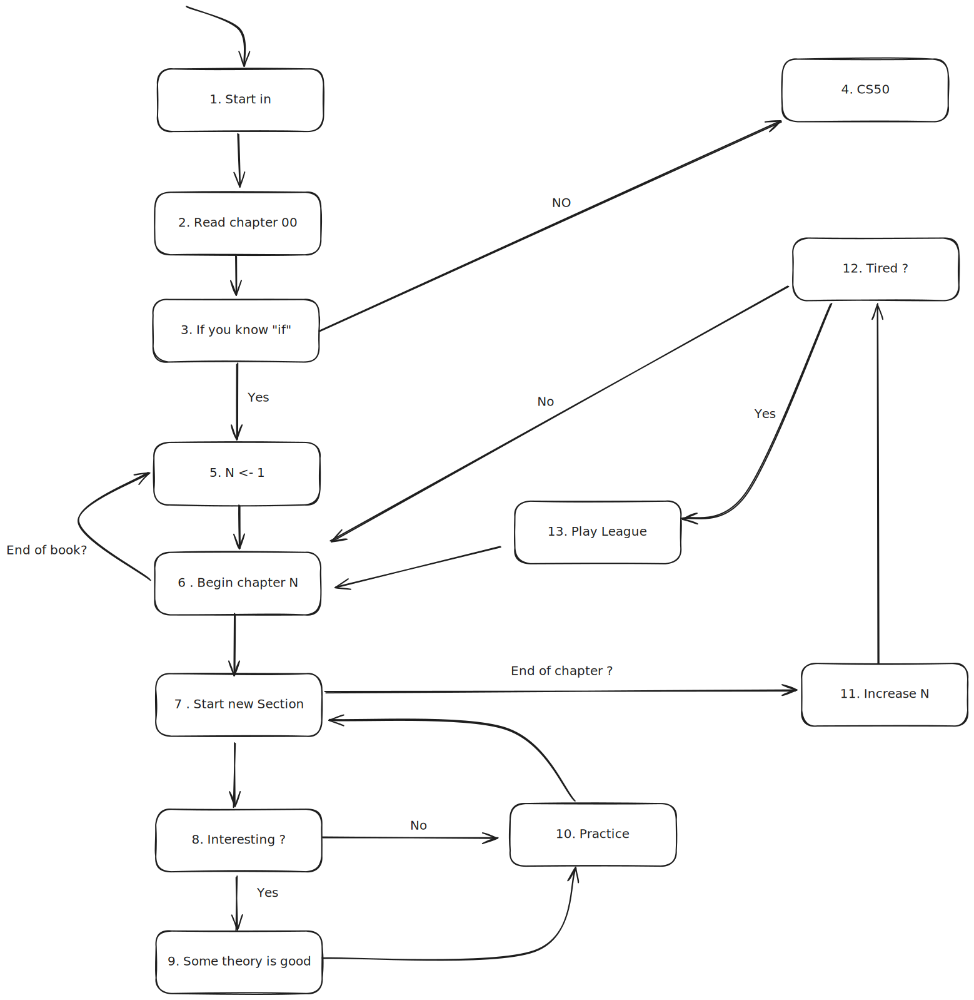

# The Pillars of Programming
_by [Mister Clayton](https://github.com/misterclayt0n) (Davi Arantes) and [Coutin](https://github.com/c0utin) (Rafael Coutinho), contributions from the Inteli Blockchain community_

Welcome to _The Pillars of Programming_

### Why This Book Exists
This book began as a course and evolved into a unique experience. Written by two lazy university students who love technology and are tired of the nonsense in the tech world, it’s here to show you that computers can do much more than just perform complex calculations. Programmers are capable of far more than just web development; there’s an infinite world of possibilities for what you can create.

We’ve seen so many software engineers limited by a narrow view of technology, offering opinions on topics that were nothing more than arcane magic to them. So many abstractions, so many metaphors to explain things. Repeating canned phrases doesn’t make you a good engineer—maybe a great parrot. This book is guided by the principle that you can only truly understand something if you could build it yourself.

These sometimes subtle barriers can prevent readers from diving into innovative projects, confining them to creating uninspired applications. We created this book to expand your perspective, to show you the almost infinite world of computing, and to demonstrate that this knowledge can be used for far more than just making money.  Computer Programming can also be an art.

### Who This Book Is For
The reader should have some prior experience in developing computer programs. This book doesn’t start from absolute zero, and it's important that you already understand concepts like variables, control flows, functions, conditionals, etc.

Mathematics isn't a major topic of this book, but to surprise you, computers “speak” math. We'll use many mathematical notations to prove certain propositions or demonstrate ideas.

However, in general, this book is meant for:

- Programmers looking to solidify their foundations.
- Newcomers to the world of computer programming.
- Curious nerds.

### Goals
This book was written with one goal in mind:

- To turn the reader into a stinking nerd.

### How to Use This Book
The book assumes you're reading it in sequence from front to back. Later chapters build on concepts from earlier ones, and some chapters may not go into profound details on a particular topic but will always reference them.

As a general guideline, here’s some pragmatic advice on how to use this content:

- Read the book at your own pace.
- It’s highly encouraged for the reader to search far beyond what the book offers.
- Be open-minded and free yourself from any closed paradigms (objects are just data structures, don’t treat them like religion).
- Write your own version of the code examples.
- Have fun.

#### Sequential Processes to Read This Book

1. Entry point for reading this book in the recommended way: but feel free to be a rebel.

2. This chapter is more than just an introduction: it contains the core pillars and principles that guide this book at a foundational level, its purpose, value, and, importantly, our principles and why you should listen to us.

3. If you don’t know what an “if” statement is, I apologize, but this material isn't for you; this book is intended for readers with prior programming experience. Please go to step 4. I recommend other, more introductory resources, such as Harvard’s CS50 course. If you do know what an "if" statement is, move on to step 5.

4. CS50 Harvard Course: Go to [CS50 Website](https://pll.harvard.edu/course/cs50-introduction-computer-science).

5. Set N to 1.

6. Start Chapter N: If this is the final chapter, return to step 5.

7. Begin the next section of Chapter N: When you reach the last section of the chapter, go to step 11.

8. If you're already familiar with the topic in this section, you may skip it and move on. However, to validate your knowledge, apply the theory you skipped. Then, go to step 10.

9. If you're finding the section interesting, or it covers unfamiliar content, a bit of theory won’t hurt.

10. Always put things into practice: You only truly understand something when you can do it yourself, so go ahead and implement what you’ve learned.

    > What i cannot create, I do not understand - Richard Feynman

11. Increment N by 1.

12. After a long journey of repeated iterations, if you’re tired, proceed to step 13. If you’re an untamed beast hungry for knowledge, go back to step 5.

13. You’ve completed another chapter like a champ. Now, go play League of Legends, guilt-free.

### Conclusion

Don’t be fooled—this is a serious book. While the language here may be more informal or unconventional than typical programming books, each chapter reflects a great deal of research, rigor, and dedication. Our intent is not only to teach you something valuable, but also to help you implement the concepts presented, with the understanding that computer programming can be both deeply challenging and genuinely enjoyable. Beyond CRUD (basic web development), programming is an art form. So, we encourage you to approach this book with an open mind and let us guide you through a uniquely crafted learning experience.

### Support Us

This book is an open-source project, and we welcome your contributions. Feel free to submit your ideas or improvements—we’ll review and discuss each one. Help us by implementing code examples and submitting them to our repository, [The Pillars of Code](www.example.com), to support newcomers on their programming journey.
